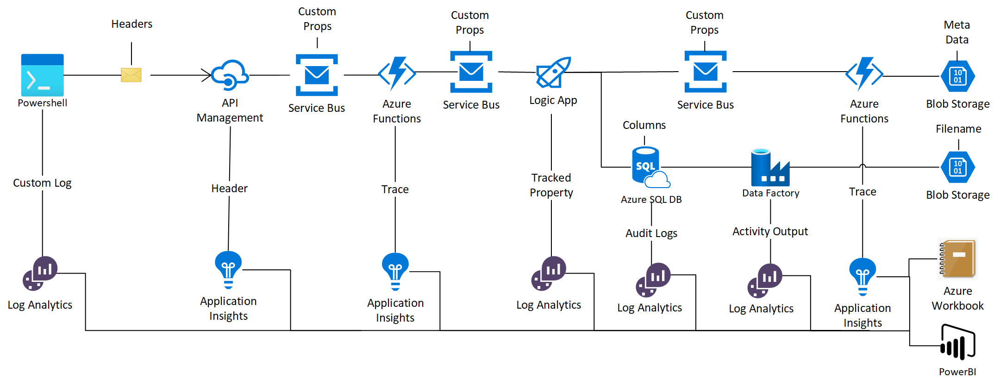

# A practical guide to Distributed Tracing in Azure

<h2>Disclaimer</h2>
This document is provided as-is without any warranty. It is intended as inspiration only. Code & configuration may not be suitable for production workloads and need proper review/changes before implementation.  

<h2>Intro</h2>

This guide describes a pattern to combine native logging options from different Azure services into a single Workbook that gives an overview of how data flowed through the system as well as a drill down into specific logs per Service.<br />
As there are some existing (and transitioning) correlation techniques already in Azure (Application Insights), I've chosen to make use of a custom set of properties to keep track of things, so it does not interfere with the existing ones.<br /> 
These properties are:<br />
<b>CustomID</b>: 	A custom identifier like a Project Name, ID or any other identifier you want to use for tracing<br />
<b>BatchID</b>:	A custom identifier for the current run. For example if there are multiple runs for the same CustomID, this field can be used to uniquely identify the current run.<br />
<b>BatchItem</b>:	If a batch/run consists of more than one item and you want to check for completeness, use this field incrementally for each of the different items.<br />
<b>BatchTotal</b>:	 If a batch/run consists of more than one item and you want to check for completeness, use this field to hold the total number of Items.<br />

<h2>Architecture</h2>
This guide is based on below architecture<br />

<br />

The architecture clearly shows that different services use both different means of transporting metadata/properties as well as different Logging endpoints and formats/content. This document describes the configuration of each of the services used to log the properties so that they can be combined / consumed.<br />
A Workbook is used to combine a number of queries that aggregate all logs into a single trace for a unique batch and allows for a drilldown into the logs of each specific service.<br />
The starting point of this flow is an API that accepts the Custom Properties as Header and a string as Body and can be called like this: <br />

 

<h2>Services</h2>

<h3>On Prem System</h3>
I've updated the architecture to include an On Prem system. In this sample it's a Powershell script that Logs a Custom Log item in Log Analytics and the fires the API call.


<h3>API Management</h3>
The entry-point in Azure of this system is Azure API Management. It is configured as a wrapper around a Service Bus Queue, allowing to apply a set of Policies, including some to both log the incoming Headers into Log Analytics, as well as putting those headers as Custom Properties on the Service Bus Queue Message.
Configuration
API Management is configured to use App Insights for logging: 
https://docs.microsoft.com/en-us/azure/api-management/api-management-howto-app-insights 
In the Settings -> Diagnostic Settings -> Additional Settings of the used API, the Headers for the Custom Properties are set to Log


The API is also configured to take the Custom Properties as Query parameters

   

In inbound policy, either the Header or the Querystring is used to propagate the Custom Properties to Properties of the Service Bus Message.

```
<set-header name="CustomId" exists-action="skip">           
 <value>
  @(context.Request.Headers.GetValueOrDefault("CustomId",context.Request.Url.Query.GetValueOrDefault("CustomId")))
</value>
</set-header>
```

          
<h3>Azure Function - Move to Queue</h3>
One of the Consumers of the Service Bus is an Azure Function that moves the message to another Service Bus Queue (just to show how one can persist the Service Bus Message Properties). <br />
The code of this Function is included in the Appendix. It basically takes a Service Bus Message as input, uses Message.Clone() to create a copy including the Custom Properties and outputs the cloned Message to another Queue. It logs the Custom Properties to App Insights.<br />
<h3>Logic Apps</h3>
The second consumer of the Service Bus Queue is Azure Logic Apps. It has Log Analytics enabled:<br />


<br />
It is triggered by the second Service Bus Queue and uses the Service Bus Send Message to send the Message body and all metadata copied from the incoming message to yet another Service Bus Queue (left picture)<br />
It has Tracked Properties defined to Log the Custom Properties (right picture) <br />
<table><tr>
<td>Clone a Message to another Queue using Send Message</td>
<td>Setting of the Action Step with Tracked Properties
</td></tr>
<tr><td>


</td><td>


</td></tr></table>
<br />

Remarks on Logic Apps
* Logic Apps does not support the setting of Blob Storage Metadata. If needed, please upvote here: https://feedback.azure.com/forums/287593-logic-apps/suggestions/34752475-set-blob-metadata-action
* Logic Apps also has Log Analytics connector for Custom Logs as described here:
https://docs.microsoft.com/en-us/azure/azure-monitor/platform/logicapp-flow-connector

<h3>Logic App  - Saving to Azure SQL Database</h3>

I've created an Azure SQL Database with a table that contains both the content of the Message as well as the Custom Properties.

```SQL
CREATE TABLE Batches
( batch_db_id [int] IDENTITY(1,1) NOT NULL,
  batchId char(50) NOT NULL,
  CustomId char(50),
  batchItem int,  
  batchTotal int,
  message text,
  ProcessedByADF BIT default 'FALSE',
  CONSTRAINT batch_id_pk PRIMARY KEY (batch_db_id)
);
``` 

The Logic App inserts a row into the database like this: <br />

 <br />

In order to see how SQL Processed the Query generated by Logic Apps to insert the data into the Database, I've turned on Azure SQL DB Audit Logs <br />

 <br />

<h3>Azure Data Factory</h3>
From SQL the different rows of data are merged into a single blob again. As Data Factory cannot work with Blob Metadata, I've used the CustomId and BatchId as filename, so they can be used for further processing. Data Factory logs all Input and Output variables into Log Analytics if this is configured as shown below:

 <br />

<h3>Azure Function - Move to Blob</h3>
The third Consumer of the Service Bus is an Azure Function that moves the message to Blob Storage. This function takes the Custom Properties of the Message and converts it to Metadata on the Blob for further processing/tracking. <br />
The code is included in this repo<br />


<h3>Azure Workbook - Stitching it all together</h3>
After all Services are configured for the logging of the Custom Properties, it is now time to tie them all together into a simple overview. I've used an Azure Workbook as user interface, but this can also be exported to PowerBI. <br />
The Workbook looks as follows:


It shows a list of all incoming calls into API Management and shows the BathcId and CustomId's from the Headers.<br />
If you select one of the Batches, the second Query is fired that uses the BatchId to find all Log Items where this BatchId is used. Passing Parameters is configured in the Advanced Settings of a Query item:<br />
 


The exported parameters can be consumed in Sub Queries by encapsulating them in accolades: {BatchId}
The second Query is the Trace through the system. If a record is select, the third query is triggerd that shows all available logging for that specific Service, based on the internal RunId of that service, related to the BatchId.<br />
In the Workbook I only show the sub queries based on the selection before using the Conditionally Visible option from the Advanced Settings:<br />


Al the Queries from the Workbook are included in the Appendix.<br />
 


<h2>Appendices</h2>
<h3>Appendix A - Workbook Queries</h3>
Query 1 - API Calls with BatchId and CustomID in Header<br/>

```
ApiManagementGatewayLogs
| project TimeGenerated, RequestHeaders["BatchId"], RequestHeaders["CustomId"] 
| project-rename  BatchId = RequestHeaders_BatchId, CustomId = RequestHeaders_CustomId
| where BatchId != ""
| top 20 by TimeGenerated desc
```

<br />
Query 2 - Union of all logs based on BatchId<br/>

```SQL

//Create Temp Table for all Application (Function Apps) Logs. If multiple App Insights instances are used, use union to combine like this:
// union app('app a ').traces, app('app b').traces
let appLogs = union app('correlationapp').traces
// I've used a simple JSON format to log the different Custom Properties from the Azure Function: 
//{"CustomId":"copiedbyDF123456","BatchId":"cbdf123456","BatchItem":"1","BatchTotal":"1","Success":"True"}
//parse_json allows for the different values to be accessable
|extend customprops = parse_json(message)
|extend BatchId = tostring(customprops.BatchId), CustomId = tostring(customprops.CustomId), BatchItem = tostring(customprops.BatchItem), BatchTotal = tostring(customprops.BatchTotal), IsRequestSuccess = tostring(customprops.Success), Service = "Function App" 
//Azure App Service uses the InvocationId as unique identifier for the function to run. It will be used in the third query to get all related tracing info for this run
|project timestamp, operation_Name, BatchId, CustomId, BatchItem, BatchTotal, IsRequestSuccess, tostring(customDimensions['InvocationId']), Service
| project-rename ServiceRunId = customDimensions_InvocationId;

//Create Temp Table for all API Management  Logs. 
let apimLogs = workspace('correlationloganalytics').ApiManagementGatewayLogs 
|extend Service = "API Management" 
//in this case, the CorrelationId is used to get additional info from APIM logs regarding the request
|project TimeGenerated, Service, OperationName, tostring(IsRequestSuccess), tostring(RequestHeaders["BatchId"]), tostring(RequestHeaders["CustomId"]), tostring(RequestHeaders["BatchItem"]), tostring(RequestHeaders["BatchTotal"]), tostring(CorrelationId)
|project-rename operation_Name = OperationName, timestamp = TimeGenerated, BatchId = RequestHeaders_BatchId, CustomId = RequestHeaders_CustomId, BatchItem = RequestHeaders_BatchItem, BatchTotal = RequestHeaders_BatchTotal, ServiceRunId = CorrelationId;


//Create Temp Table for all Logic App Logs. 
let logicAppLogs = workspace('correlationloganalytics').AzureDiagnostics
|project TimeGenerated, OperationName, tostring(status_s),  tostring(trackedProperties_BatchId_g),  tostring(trackedProperties_CustomId_s),  tostring(trackedProperties_BatchTotal_s),  tostring(trackedProperties_BatchItem_s),  tostring(resource_runId_s)
|project-rename operation_Name = OperationName, timestamp = TimeGenerated, IsRequestSuccess = status_s, BatchId = trackedProperties_BatchId_g, CustomId = trackedProperties_CustomId_s, BatchItem = trackedProperties_BatchItem_s, BatchTotal = trackedProperties_BatchTotal_s, ServiceRunId = resource_runId_s
|extend Service = "Logic App"; 

//create Temo table for all Custom customEvents
let customLogs = workspace('correlationloganalytics').CustomLogForAPICalls_CL 
| where SourceSystem == "RestAPI"
|project TimeGenerated, tostring(BatchId_g),  tostring(CustomId_s),  tostring(BatchTotal_d),  tostring(BatchItem_d) 
|project-rename timestamp = TimeGenerated, BatchId = BatchId_g, CustomId = CustomId_s, BatchItem = BatchItem_d, BatchTotal = BatchTotal_d
|extend operation_Name = "API from On Prem", Service = "On Premise", IsRequestSuccess = "True", ServiceRunId = BatchId; 


//Create Temp Table for all SQL Audit Logs.
let sqlLogs = workspace('correlationloganalytics').AzureDiagnostics 
//now this is a bit dirty. We take the SQL statement generated by Logic Apps to check if it is an Insert Statement into our table and if it contains the BatchId 
| where Category == "SQLSecurityAuditEvents" and Resource != "MASTER" and statement_s contains "batchId" and statement_s contains "insert into [dbo].[Batches]" and  statement_s contains "{BatchId}" and  statement_s contains "{CustomId}"
|project TimeGenerated, OperationName, tostring(succeeded_s),  tostring(event_id_g)
|project-rename operation_Name = OperationName, timestamp = TimeGenerated, IsRequestSuccess = succeeded_s, ServiceRunId = event_id_g
//as we use the BatchId and CustomId from the parameters and don't extract it from SQL, we populate it from the Parameters.
//please note that this is error prone and can cause confusion and or mistakes.
//please notify me if you have a better solution for this. Thanks!
|extend Service = "SQL DB", BatchId = "{BatchId}",  CustomId = "{CustomId}", BatchItem = "-", BatchTotal = "-" ; 

//Create Temp Table for all Data Factory Logs. 
let ADFLogs = workspace('correlationloganalytics').ADFActivityRun
//Input and Output information for each Activity is stored in JSON 
|extend customprops = parse_json(Input)
//As with SQL a bit dirty to use 'contains' here
| where OperationName  startswith "CopyToBlob" and customprops.source.sqlReaderQuery contains "WHERE BatchId = '{BatchId}"
|project TimeGenerated, OperationName, tostring(Status),  tostring(PipelineRunId)
|project-rename operation_Name = OperationName, timestamp = TimeGenerated, IsRequestSuccess = Status, ServiceRunId = PipelineRunId
|extend Service = "Data Factory", BatchId = "{BatchId}",  CustomId = "{CustomId}", BatchItem = "-", BatchTotal = "-" 
//only get last 1 result, as multiple records are created for Queueud, In Progress and Succeeded
|top 1 by timestamp desc; 

//Create Union all temp tables and filter for BatchId from Parameter. 
 apimLogs | union appLogs,  sqlLogs,logicAppLogs, ADFLogs, logicAppLogs, customLogs
 //this is where we apply the filter for BatchId (except for SQL Audit Logs, that query is already filtered based on the SQL statement). Maybe you want to filter on the CustomId as well, then add and 
 |where BatchId == "{BatchId}"
  //order from oldest to newest, so the actual trail through the services is shown
| order by timestamp asc

```

<br />
Query 3a - All APIM logs based on CorrelationId<br/>

```
ApiManagementGatewayLogs 
|where CorrelationId == "{ServiceRunId}"
|top 20 by TimeGenerated asc
```

<br />
Query 3b - All logs for Azure Functions based on InvocationId<br/>

```
union traces | union exceptions | where timestamp > ago(30d) | where customDimensions['InvocationId'] == "{ServiceRunId}" | order by timestamp asc
```

<br />
Query 3c - All Logic App Logs based on resource_runId_s<br/>

```
AzureDiagnostics 
|where resource_runId_s  == "{ServiceRunId}" and Category == "WorkflowRuntime"
|top 20 by TimeGenerated asc
| project TenantId, TimeGenerated, ResourceId, ResourceGroup, SubscriptionId, Resource, ResourceType, OperationName, ResultType, CorrelationId, ResultDescription, status_s, startTime_t, endTime_t, workflowId_s, resource_location_s, resource_workflowId_g, resource_originRunId_s
```


<br />
Query 3d - All SQL DB Audit Logs based on event_id_g<br/>

```
AzureDiagnostics 
| where Category == "SQLSecurityAuditEvents" and event_id_g == "{ServiceRunId}"
|top 20 by TimeGenerated asc
| project TenantId, TimeGenerated, ResourceId, ResourceGroup, SubscriptionId, Resource, ResourceType, OperationName, statement_s, succeeded_s, client_ip_s, server_instance_name_s, database_name_s, event_id_g, action_name_s
```

<br />

<br />
Query 3e - All Data Factory Runbook Logs based on PipelineRunId<br/>

```
ADFActivityRun
| where PipelineRunId == "{ServiceRunId}"
| order by TimeGenerated asc
```

<br />


<br />
Query 3f - All Custom Logs based on BatchId<br/>

```
CustomLogForAPICalls_CL 
|where BatchId_g  == "{ServiceRunId}"
|top 20 by TimeGenerated asc

```

<br />


<h3>Findings & Recommendations</h3>

Kusto Query Language (KQL) is a powerful big data analytics language:
https://docs.microsoft.com/en-us/azure/data-explorer/kusto/concepts/ <br />
Samples: https://dataexplorer.azure.com/clusters/help/databases/Samples<br />

Workbooks are an effective way to make working documents out of the data <br />
https://docs.microsoft.com/en-us/azure/azure-monitor/platform/workbooks-overview<br /> 

* Ingestion and processing of Logs takes some time (up to 10 minutes) before results show up. It is not (near) real time logging. <br />
* Set Diagnostic Logging to Resource Specific as single table can only hold a fixed number of columns (grows quite fast)
* SQL Audit Logging Data Factory Activity Logging is Log Intensive, might be more suitable for explicit runs/tests <br />
* Running 'Contains' queries is errorprone. Be mindful <br />
* Logic App can read Custom Metadata from Blob, but can not write it <br />
* Data Factory can not read nor write Blob Custom Metadata
* Please note that the Blob Storage Trigger is not 100% reliable;
https://docs.microsoft.com/en-us/azure/azure-functions/functions-bindings-storage-blob-trigger <br />

 - The recommended approach is to use Service Bus / Event Grid for reliable messaging as described in the Architecture Centre: https://docs.microsoft.com/en-us/azure/architecture/reference-architectures/enterprise-integration/queues-events <br /> 

<h3>Appendix C - Used References</h3>
https://docs.microsoft.com/en-us/azure/azure-monitor/app/correlation (HTTP Correlation Deprecated) <br />
https://docs.microsoft.com/en-us/azure/service-bus-messaging/service-bus-end-to-end-tracing<br />
https://docs.microsoft.com/en-us/azure/service-bus-messaging/service-bus-messages-payloads<br />
https://docs.microsoft.com/en-us/azure/architecture/reference-architectures/enterprise-integration/queues-events<br /> 
https://docs.microsoft.com/en-us/rest/api/storageservices/set-blob-metadata<br />
https://docs.microsoft.com/en-us/azure/azure-monitor/platform/logicapp-flow-connector<br />
https://azure.microsoft.com/nl-nl/blog/query-azure-storage-analytics-logs-in-azure-log-analytics/<br />
https://github.com/Azure/azure-functions-powershell-worker/issues/309<br />
https://github.com/Azure/azure-webjobs-sdk/issues/2154<br />
https://github.com/Azure/azure-functions-servicebus-extension/issues/13<br />
https://github.com/Azure/azure-sdk-for-net/blob/master/sdk/servicebus/Microsoft.Azure.ServiceBus/src/Core/MessageSender.cs<br />
https://github.com/Azure/Azure-Functions/issues/693<br />
https://github.com/xstof/xstof-fta-distributedtracing <br />
https://www.pluralsight.com/guides/implementing-distributed-tracing-with-azure's-application-insights<br />
https://medium.com/prospa-engineering/how-azures-application-insights-correlates-telemetry-a73731f30bbd
https://medium.com/prospa-engineering/implementing-distributed-tracing-with-azures-application-insights-5a09cc1c200c<br />
https://brettmckenzie.net/2019/10/02/things-i-wish-i-knew-earlier-about-distributed-tracing-in-azure-application-insights/<br />
https://brettmckenzie.net/2019/10/20/consider-using-service-bus-queues-instead-of-azure-storage-queues-when-using-application-insights/<br />
https://www.serverlessnotes.com/docs/azure-functions-use-application-insights-for-logging<br />
https://dev.applicationinsights.io/documentation/Using-the-API/Power-BI<br />
https://mihirkadam.wordpress.com/2019/06/27/azure-functions-how-to-write-a-custom-logs-in-application-insights/<br />
https://feedback.azure.com/forums/287593-logic-apps/suggestions/34752475-set-blob-metadata-action<br />
https://stackoverflow.com/questions/28637054/error-while-deserializing-azure-servicebus-queue-message-sent-from-node-js-azur<br />
https://stackoverflow.com/questions/42117135/send-a-full-brokered-message-in-azure-service-bus-from-an-azure-function<br />
https://stackoverflow.com/questions/51883367/can-you-set-metadata-on-an-azure-cloudblockblob-at-the-same-time-as-uploading-it<br />
https://stackoverflow.com/questions/52419414/brokeredmessage-send-and-message-consumer-in-azure-function-v2<br />
https://stackoverflow.com/questions/56473786/how-to-upload-zip-file-from-api-management-to-blob-storage<br />
https://yinlaurent.wordpress.com/2019/03/24/debug-your-azure-api-management-policies-with-custom-logs/<br />
https://docs.microsoft.com/en-us/azure/data-explorer/kusto/query/parseoperator<br />
https://stackoverflow.com/questions/59725608/unknown-function-app-while-merging-two-application-insights-resources<br />
https://azure.github.io/AppService/2019/11/01/App-Service-Integration-with-Azure-Monitor.html<br />
https://stackoverflow.com/questions/55538434/how-to-write-kusto-query-to-get-results-in-one-table<br />
https://stackoverflow.com/questions/63779632/split-column-string-with-delimiters-into-separate-columns-in-azure-kusto<br />
https://camerondwyer.com/2020/05/26/how-to-report-on-serialized-json-object-data-in-application-insights-azure-monitor-using-kusto/<br />
https://docs.microsoft.com/nl-nl/azure/azure-monitor/platform/powerbi<br />
https://docs.microsoft.com/en-us/azure/data-factory/connector-azure-blob-storage<br />
https://www.sqlshack.com/populate-azure-sql-database-from-azure-blob-storage-using-azure-data-factory/<br />
https://docs.microsoft.com/en-us/azure/data-factory/copy-activity-preserve-metadata#preserve-metadata<br />
https://knowledgeimmersion.wordpress.com/2020/02/26/custom-log-analytics-for-azure-data-factory/<br />
https://github.com/Azure/azure-sdk-for-python/issues/12050<br />
https://docs.microsoft.com/en-us/azure/azure-sql/database/auditing-overview <br />
https://feedback.azure.com/forums/270578-data-factory/suggestions/33983473-copy-blob-with-properties-and-metadata <br />
https://docs.microsoft.com/en-us/azure/data-factory/monitor-using-azure-monitor <br />
https://docs.microsoft.com/en-us/azure/data-factory/tutorial-hybrid-copy-portal <br />
https://feedback.azure.com/forums/270578-data-factory/suggestions/36163726-append-replace-upsert-the-outgoing-data-from-copy <br />